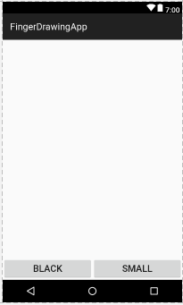
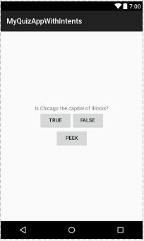
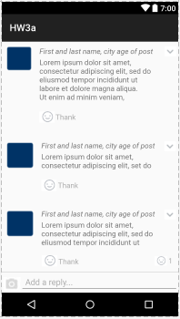

# AndroidStudioProjects
some useful apps made in Android Studio

## 1. FingerDrawingApp
An app enabling the users to draw customized contents, with some constraints and features implemented

### Interface Overview

Users can simply draw anything they want on the screen with their fingers
- click `Black` to change the line color
- click `Small` to change the line width
- users will not be able to draw if the phone is pitched > 20 degree

## 2. MyQuizAppWithIntents
A quiz app, users can answer the questions proposed and the app can tell the users the correctness,
leading the users to some useful pages if the answers are not correct

### Interface Overview

Users can click on "true" or "false" to see whether their knowledge is correct
Users can also click "peek" to get some hints. They will be prompted to choose between:
- opening an in-app activity which directly tells the users the correct answer
- opening a wikipedia webpage to learn some useful knowledge

## 3. UIDesign_SocialMedia

It's an imitation of a social media page

